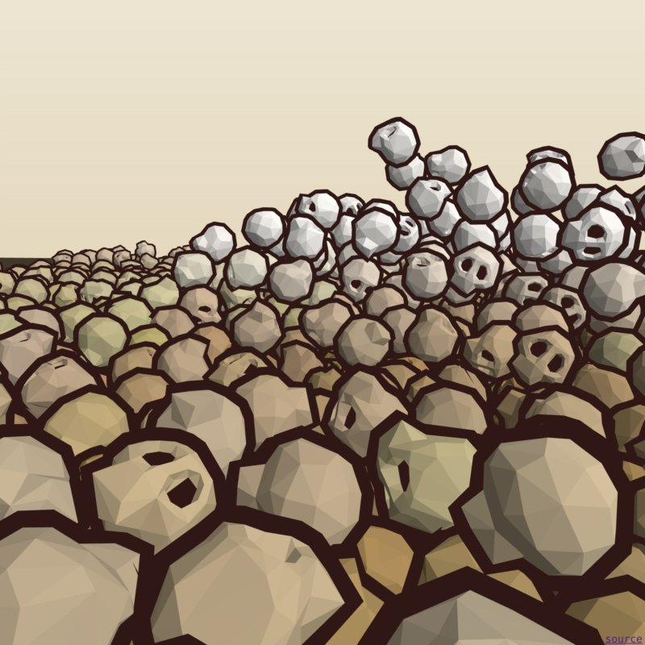

# Skull Ocean

   

> A grim wave simulation

💀💀🌊

[game](https://platane.github.io/skull-ocean/index.html)

# TODO

- [x] [phy] quad tree to speed up collision detection
- [ ] [phy] rotation impulse on contact
- [ ] [phy] run in worker
- [ ] [phy] round world instead of squared
- [ ] [rendering] sky box
- [ ] [rendering] surfer
- [ ] [rendering] depth effect
- [ ] [phy] waves
- [ ] [phy] wave riding
- [ ] [gameplay] controls
- [ ] ~~[phy] move the physic world as the surfer moves (is that even possible ?)~~
